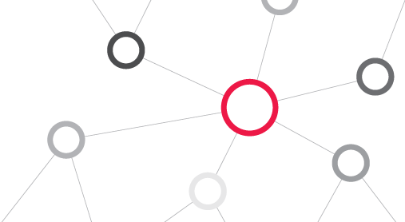

# circlecast



## What 

[CircleDB](https://www.aosabook.org/en/500L/an-archaeology-inspired-database.html) (revisited/extended/improved)
on top of [Hazelcast](https://hazelcast.com/) (see `com.hazelcast.cp.IAtomicReference` for the exact construct utilised).

#### tl;dr - poor man's datomic
A [datomic](https://www.datomic.com/)-like database. Uses `hazelcast 4` for distributed _ACI_, and is compatible with `duratom` (for the _D_).
Querying is done with a `datalog` variant. See the `intro.md` for details.  


## DB structure
One has to really read the article linked in the first sentence of this README, in order to fully understand/appreciate
the design around this. In short, a database is essentially a collection of layers. Each layer represents a point in time
when a new fact was discovered. That includes insertions, updates and deletions (i.e. always growing by adding layers).
The last layer represents the current information (for all the entities). An entity is something uniquely named with a set of attributes, 
each having a value (at a particular point in time). Rather datomic-like actually...


## DB connection
Immutable databases need a way of transitioning from one state to another. For dev/test work, a regular Clojure atom will suffice.
For a distributed atom, refer to `circlecast.atoms.hazelcast.HazelcastAtom` and its constructor-fn `circlecast.atoms.hazelcast.hz-atom.`


## Usage 

Assuming a Hazelcast instance `hz-instance` (e.g. the result of `(Hazelcast/newHazelcastInstance)`), the following returns an empty DB.

```clj
(require '[hazel-atom.core :refer [hz-atom]] 
         '[circlecast.fdb.constructs  :refer [make-db]])

(def db-name "myDB")
;; make-db can be called w/o args but returns regular atom
(def DB (make-db (partial hz-atom (-> hz-instance .getCPSubsystem (.getAtomicReference db-name)))))

@DB 
;; => an empty DB
#circlecast.fdb.constructs.Database
{:layers [#circlecast.fdb.constructs.Layer{:storage #circlecast.fdb.storage.InMemory{},
                                           :VAET {},
                                           :AVET {},
                                           :VEAT {},
                                           :EAVT {},
                                           :tx-ts {:second/nano 174453000,
                                                   :epoch/second 1595261373,
                                                   :epoch/milli 1595261373174,
                                                   :epoch/micro 1595261373174453,
                                                   :epoch/nano 1595261373174453000}}],
 :present 0}

```
See test namespace `circlecast.fdb.world.clj` for a more involved example.

### Transactions 

#### Adding/updating

#### Deleting

## Persistence
How data should be persisted in this model (distributed memory-grid), will ultimately depend on the actual application. 
For example, if we accept the fact that the data is duplicated across the cluster (and therefore unlikely to be lost at any given time),
a simple _periodic-backup_ approach could potentially suffice (see `hazelcast-client` for talking to a cluster when not a member of it). 
Since the entire DB is an EDN value, this approach would be somewhat trivial to implement. 

If a more formal/consistent approach is required, Hazelcast itself provides enterprise storage [solutions](https://hazelcast.com/product-features/imdg-comparison/). 

Putting that stuff aside for a moment, I am more interested/excited about how nicely this plays with [duratom](https://github.com/jimpil/duratom),
which is wrapper-type for atoms whose whole purpose is to add durability (on every state change). Why is that relevant, I hear you ask...
Well, this entire library is based around the `circlecast.atoms.hazelcast.HazelcastAtom` type (implementing `IAtom`, `IAtom2` \& `IDeref`), 
which a `duratom` will happily wrap. This is a win-win situation! Not only one can add persistence to a hazelcast atom 
(by wrapping it with a `duratom`), but existing `duratom` users can also add distribution to their atoms (by replacing them with hazelcast atoms).
Frankly, I never intended for `duratom` to be something distributable, but in this context (where atomicity **and** distribution are provided by the underlying atom) 
everything falls into place quite beautifully. Here is how to create an atom distributed via Hazelcast, and persisted on PostgresDB via `duratom`:
                                               
```clj
(require '[circlecast.atoms.hazelcast :refer [hz-atom]]
         '[circlecast.fdb.constructs  :refer [make-db]
         '[duratom.core :refer [with-atom-ctor duratom]]])
                                               
(def db-name "myPersistedDB")
(def DB 
  (with-atom-ctor (partial hz-atom (-> hz-instance .getCPSubsystem (.getAtomicReference db-name)))
    (duratom :postgres-db
             :db-config "any db-spec as understood by clojure.java.jdbc"
             :table-name "my_table"
             :row-id 0                   ;; different nodes in the cluster could write to different rows
             :init (make-db identity)))) ;; init-value is only relevant when nothing is found in storage 
                                               
@DB 
;; => an empty DB (same as before)
```                                               

## Hazelcast controversy
Back in 2017, `jepsen.io` produced an [analysis](https://jepsen.io/analyses/hazelcast-3-8-3) of version 3.8.3, 
exposing certain holes/bugs, and the project received a fair bit of criticism, 
for example [here](https://news.ycombinator.com/item?id=15416848). Since then, version 4 has been released 
and the devs seem confident about it, while still using `jepsen` as a testing tool. 
Read more [here](https://hazelcast.com/blog/testing-the-cp-subsystem-with-jepsen/).   
 
## Requirements

- Hazelcast 4 

## License

Copyright © 2020 Dimitrios Piliouras

This program and the accompanying materials are made available under the
terms of the Eclipse Public License 2.0 which is available at
http://www.eclipse.org/legal/epl-2.0.

This Source Code may also be made available under the following Secondary
Licenses when the conditions for such availability set forth in the Eclipse
Public License, v. 2.0 are satisfied: GNU General Public License as published by
the Free Software Foundation, either version 2 of the License, or (at your
option) any later version, with the GNU Classpath Exception which is available
at https://www.gnu.org/software/classpath/license.html.
